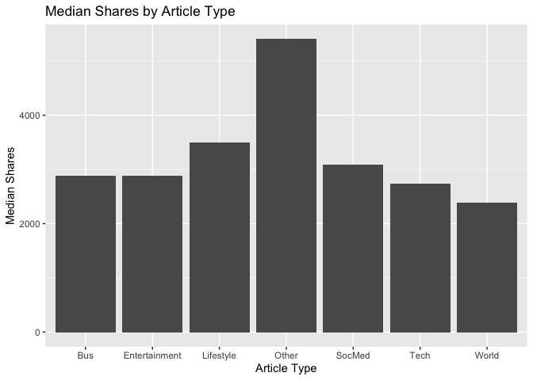

Online News Analysis - Predicting Media Shares by Article
Characteristics
================
Matt Kasle
10/15/2020

# thursday articles

## Introduction

This dataset summarizes a heterogeneous set of features about articles
published by Mashable in a period of two years. The goal is to predict
the number of shares in social networks (popularity).

There are 61 attributes, 58 which are predictive attributes, 2 of which
are non-predictive (url and timestamp), and 1 that is the target.

The types of veriables include the number of words in the article, the
number of words in the title, the positivity and sentimentality of the
article, the article’s subject, the number of keywords used, and much
more.

The objective of this project is to predict the number of social media
shares using two different tree-based algorithms. The first algorithm
will be a non-ensemble regression tree, and the second algorithm will be
a boosted trees algorithm, which is a state-of-the-art classification
technique.

The other objective of this project is to create an automated report
that outputs the classification analysis for each articles published on
each weekday.

The required packages to run this analysis are tidyverse, caret, tree,
and patchwork.

## Data

First, we need to read in the data and set up the subsetting of the data
into a single weekday. Then, we’ll split the data set to a training and
test set for training and evaluating the classificaiton models. A 70/30
train-test split will be used.

``` r
set.seed(1)
library(tidyverse)
library(caret)
library(tree)

news <- read_csv("OnlineNewsPopularity.csv")
```

``` r
varDayOfWeek <- parse(text=paste0("weekday_is_", params$day_of_week))
news <- news %>% filter(eval(varDayOfWeek) == 1)

news <- news %>% select(-url, -timedelta, -weekday_is_monday, -weekday_is_tuesday, -weekday_is_wednesday,
                        -weekday_is_thursday,-weekday_is_friday, 
                        -weekday_is_saturday, -weekday_is_sunday, -is_weekend)

newsIndex <- createDataPartition(news$shares, p = 0.3, list = FALSE)
newsTrain <- news[newsIndex, ]
newsTest <- news[-newsIndex, ]
```

## Summarizations

Below are summary statistics of the online news data set, such as the
number of observations in the train set, a numerical summary of the
response variable (number of social media shares), a distribution of the
response, and relationships between the response and interesting
variables in the dataset.

Number of rows in training set:

``` r
nrow(newsTrain)
```

    ## [1] 2183

Summary of response variable:

``` r
summary(newsTrain$shares)
```

    ##     Min.  1st Qu.   Median     Mean  3rd Qu.     Max. 
    ##     22.0    901.5   1400.0   2953.3   2600.0 227300.0

It is important to make note of the minimum and maximum of the response
variable, as well as the median and quartiles. For future analysis, it
may be best to remove outliers.

Distribution of response variable:

``` r
ggplot(data = newsTrain, aes(x = shares)) +
  geom_histogram() + xlab("Shares") + ggtitle(paste("Distribution of Shares in Training Data - ",
                                                    params$day_of_week))
```

<!-- -->

Below is a plot of four interesting variables to the response variable,
shares. We want to see if there are any intersting patterns here.

``` r
library(patchwork)
par(mfrow=c(2,2))
plot1 <- ggplot(data=news, aes(x = news$n_unique_tokens, y = shares)) + geom_point(stat = "identity") +
    labs(x="Unique Words in Article", y="Shares")

plot2 <- ggplot(data=news, aes(x = news$rate_positive_words, y = shares)) + geom_point(stat = "identity") +
    labs(x="Rate of Positive Words", y="")

plot3 <- ggplot(data=news, aes(x = news$rate_negative_words, y = shares)) + geom_point(stat = "identity") +
    labs(x="Rate of Negative Words", y="Shares")

plot4 <- ggplot(data=news, aes(x = news$global_sentiment_polarity, y = shares)) + geom_point(stat = "identity") +
    labs(x="Sentiment Polarity", y="")

plot1 + plot2 + plot3 + plot4
```

    ## Warning: Use of `news$n_unique_tokens` is discouraged. Use `n_unique_tokens` instead.

    ## Warning: Use of `news$rate_positive_words` is discouraged. Use `rate_positive_words` instead.

    ## Warning: Use of `news$rate_negative_words` is discouraged. Use `rate_negative_words` instead.

    ## Warning: Use of `news$global_sentiment_polarity` is discouraged. Use `global_sentiment_polarity` instead.

<!-- -->

There are six different article subjects. It would be interesting to
know if some subjects are more popular than others, so we can plot the
median shares by the different article types.

``` r
news['article_type'] <- ifelse(news$data_channel_is_lifestyle == 1, "Lifestyle",
       ifelse(news$data_channel_is_entertainment == 1, "Entertainment",
       ifelse(news$data_channel_is_world == 1, "World",
       ifelse(news$data_channel_is_bus == 1, "Bus",
       ifelse(news$data_channel_is_socmed == 1, "SocMed",
       ifelse(news$data_channel_is_tech == 1, "Tech","Other"))))))

ggplot(data=news, aes(x = article_type, y = shares)) + geom_bar(stat = "summary", fun.y = "median") +
    labs(x="Article Type", y="Median Shares", title="Median Shares by Article Type")
```

    ## Warning: Ignoring unknown parameters: fun.y

    ## No summary function supplied, defaulting to `mean_se()`

<!-- -->

``` r
# drop column used for plotting
news <- news %>% select(-article_type)
```

## Modeling

There should be text describing the type of model you are fitting, your
fitting process, and the final chosen model (this last part is to be
automated so I don’t expect you to explicitly interpret that model, but
you should be able to display something about the final model chosen on
the training data).

### Regression Tree Model

The first model fit to the data will be a regression tree. We’ll use
leave-one-out cross-validation to determine the optimal size of the
model, as defined by number of splits. By plotting the fitted tree, we
can see the deviance by tree size (larger deviance means a better fit).

``` r
treeFit <- tree(shares ~ ., data = newsTrain)
summary(treeFit)
```

    ## 
    ## Regression tree:
    ## tree(formula = shares ~ ., data = newsTrain)
    ## Variables actually used in tree construction:
    ## [1] "kw_avg_avg" "num_hrefs" 
    ## Number of terminal nodes:  3 
    ## Residual mean deviance:  45320000 = 9.881e+10 / 2180 
    ## Distribution of residuals:
    ##     Min.  1st Qu.   Median     Mean  3rd Qu.     Max. 
    ## -15110.0  -1766.0  -1341.0      0.0   -240.8 224800.0

``` r
pruneFit <- cv.tree(treeFit,
                  K=nrow(newsTrain)-1
                  )


pruneFitFinal <- prune.tree(treeFit, best = pruneFit$size[1]) 

plot(pruneFit$size ,pruneFit$dev ,type="b")
```

<!-- -->

### Boosted tree model

Next, we’ll fit a boosted regression tree. The boosted tree algorithm
has a few hyperparameters, and we’ll use repeated 10-fold
cross-validation to determine the optimal hyperparameter values. The
hyperparameters of the optimal boosted tree is printed below, as well a
summary of each fitted model.

``` r
fitControl <- trainControl(## 10-fold CV
                           method = "repeatedcv",
                           number = 10,
                           ## repeated ten times
                           repeats = 5
                           )

boostedFit <- train(shares ~ ., data = newsTrain, 
                 method = "gbm", 
                 trControl = fitControl, 
                 verbose = FALSE
                 )

boostedFit$bestTune
```

    ##   n.trees interaction.depth shrinkage n.minobsinnode
    ## 1      50                 1       0.1             10

``` r
boostedFit$results
```

    ##   shrinkage interaction.depth n.minobsinnode n.trees     RMSE   Rsquared      MAE   RMSESD RsquaredSD    MAESD
    ## 1       0.1                 1             10      50 5819.285 0.03995600 2506.175 3536.858 0.03456849 365.8769
    ## 4       0.1                 2             10      50 6005.761 0.02323220 2573.457 3478.829 0.02298231 370.3773
    ## 7       0.1                 3             10      50 6016.262 0.02819922 2600.250 3466.042 0.02829338 359.0629
    ## 2       0.1                 1             10     100 5844.459 0.04238553 2528.208 3533.218 0.03730936 379.1860
    ## 5       0.1                 2             10     100 6151.887 0.02110848 2679.940 3438.671 0.02428009 366.0115
    ## 8       0.1                 3             10     100 6182.216 0.02420803 2733.599 3416.553 0.02634264 352.4273
    ## 3       0.1                 1             10     150 5848.139 0.04468921 2537.955 3529.133 0.03863956 375.5992
    ## 6       0.1                 2             10     150 6214.168 0.02065998 2753.700 3419.594 0.02516954 359.3457
    ## 9       0.1                 3             10     150 6296.936 0.02211659 2837.559 3380.756 0.02444534 338.3367

### Linear regression model

Next, we’ll fit a multiple linear regression model on train data.
Summary of the model is printed below.

``` r
linearfit<-lm(shares~.,data=newsTrain)
summary(linearfit)
```

    ## 
    ## Call:
    ## lm(formula = shares ~ ., data = newsTrain)
    ## 
    ## Residuals:
    ##    Min     1Q Median     3Q    Max 
    ##  -9605  -2072   -901    341 218909 
    ## 
    ## Coefficients: (2 not defined because of singularities)
    ##                                 Estimate Std. Error t value Pr(>|t|)   
    ## (Intercept)                    3.140e+03  2.273e+03   1.382  0.16723   
    ## n_tokens_title                 1.115e+02  7.118e+01   1.566  0.11739   
    ## n_tokens_content              -4.133e-01  6.267e-01  -0.659  0.50969   
    ## n_unique_tokens                6.147e+02  4.958e+03   0.124  0.90134   
    ## n_non_stop_words              -4.340e+03  4.174e+03  -1.040  0.29857   
    ## n_non_stop_unique_tokens      -4.447e+02  4.130e+03  -0.108  0.91428   
    ## num_hrefs                      5.697e+01  1.896e+01   3.005  0.00269 **
    ## num_self_hrefs                 6.094e+00  4.714e+01   0.129  0.89715   
    ## num_imgs                      -1.644e+01  2.419e+01  -0.680  0.49667   
    ## num_videos                    -1.729e+01  5.032e+01  -0.344  0.73111   
    ## average_token_length          -1.346e+02  6.152e+02  -0.219  0.82688   
    ## num_keywords                  -2.594e+02  9.308e+01  -2.787  0.00536 **
    ## data_channel_is_lifestyle     -1.696e+02  1.008e+03  -0.168  0.86642   
    ## data_channel_is_entertainment -1.786e+03  6.825e+02  -2.617  0.00893 **
    ## data_channel_is_bus           -1.280e+03  9.544e+02  -1.341  0.18018   
    ## data_channel_is_socmed        -1.496e+03  8.812e+02  -1.697  0.08975 . 
    ## data_channel_is_tech          -7.808e+02  9.303e+02  -0.839  0.40138   
    ## data_channel_is_world         -5.451e+02  9.388e+02  -0.581  0.56153   
    ## kw_min_min                     9.052e+00  4.311e+00   2.100  0.03589 * 
    ## kw_max_min                    -7.642e-02  1.882e-01  -0.406  0.68467   
    ## kw_avg_min                     5.136e-01  1.238e+00   0.415  0.67830   
    ## kw_min_max                     3.129e-03  2.484e-03   1.260  0.20780   
    ## kw_max_max                     2.551e-03  1.498e-03   1.703  0.08871 . 
    ## kw_avg_max                    -4.905e-03  2.092e-03  -2.345  0.01912 * 
    ## kw_min_avg                    -2.836e-01  2.018e-01  -1.406  0.15998   
    ## kw_max_avg                    -1.135e-01  8.572e-02  -1.324  0.18570   
    ## kw_avg_avg                     1.056e+00  4.116e-01   2.565  0.01037 * 
    ## self_reference_min_shares     -4.211e-02  2.828e-02  -1.489  0.13660   
    ## self_reference_max_shares     -2.589e-02  1.855e-02  -1.396  0.16283   
    ## self_reference_avg_sharess     7.278e-02  4.497e-02   1.618  0.10573   
    ## LDA_00                        -8.644e+02  1.138e+03  -0.760  0.44757   
    ## LDA_01                        -7.880e+02  1.306e+03  -0.603  0.54634   
    ## LDA_02                        -1.638e+03  1.128e+03  -1.453  0.14650   
    ## LDA_03                        -8.088e+02  1.229e+03  -0.658  0.51057   
    ## LDA_04                                NA         NA      NA       NA   
    ## global_subjectivity            3.976e+03  2.139e+03   1.859  0.06314 . 
    ## global_sentiment_polarity     -1.312e+03  3.968e+03  -0.331  0.74096   
    ## global_rate_positive_words     9.802e+03  1.761e+04   0.557  0.57787   
    ## global_rate_negative_words     2.584e+03  3.547e+04   0.073  0.94193   
    ## rate_positive_words            1.464e+02  2.865e+03   0.051  0.95924   
    ## rate_negative_words                   NA         NA      NA       NA   
    ## avg_positive_polarity          3.200e+03  3.388e+03   0.944  0.34511   
    ## min_positive_polarity         -2.312e+03  2.774e+03  -0.833  0.40477   
    ## max_positive_polarity         -1.078e+02  1.086e+03  -0.099  0.92098   
    ## avg_negative_polarity          1.297e+03  3.245e+03   0.400  0.68936   
    ## min_negative_polarity         -1.603e+03  1.193e+03  -1.344  0.17905   
    ## max_negative_polarity          9.321e+02  2.668e+03   0.349  0.72683   
    ## title_subjectivity            -7.284e+02  6.692e+02  -1.089  0.27647   
    ## title_sentiment_polarity      -1.015e+03  6.477e+02  -1.567  0.11715   
    ## abs_title_subjectivity         6.564e+01  9.315e+02   0.070  0.94383   
    ## abs_title_sentiment_polarity   1.557e+03  1.019e+03   1.527  0.12684   
    ## ---
    ## Signif. codes:  0 '***' 0.001 '**' 0.01 '*' 0.05 '.' 0.1 ' ' 1
    ## 
    ## Residual standard error: 6708 on 2134 degrees of freedom
    ## Multiple R-squared:  0.05389,    Adjusted R-squared:  0.03261 
    ## F-statistic: 2.532 on 48 and 2134 DF,  p-value: 5.03e-08

## Model Evaluations

Finally, we’ll evaluate the performance of each model by seeking the
lowest root mean squared error of its predictions on the test dataset
when compared to the actual values in the dataset. This should be a good
approximation of the model’s performance on unseen data.

### Regression Tree

Below is the RMSE of the optimal (non-ensemble) regression tree:

``` r
treePred <- predict(pruneFitFinal, newdata = dplyr::select(newsTest, -shares))
sqrt(mean((treePred-newsTest$shares)^2))
```

    ## [1] 10320.2

### Boosted Trees

Below is the RMSE of the optimal boosted regression tree:

``` r
boostedTreePred <- predict(boostedFit, newdata = dplyr::select(newsTest, -shares))
sqrt(mean((boostedTreePred-newsTest$shares)^2))
```

    ## [1] 10285.08

### linear regression

Below is the RMSE of the multiple linear model:

``` r
linearPred<-predict(linearfit, newdata=dplyr::select(newsTest, -shares))
sqrt(mean((linearPred-newsTest$shares)^2))
```

    ## [1] 10329.17
